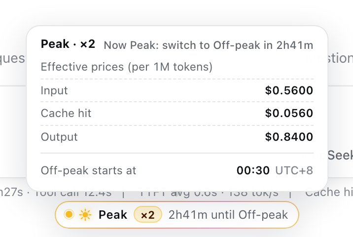
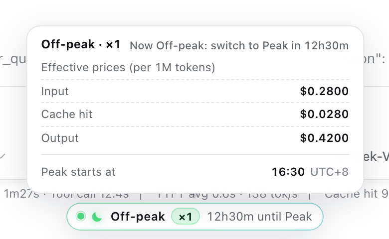
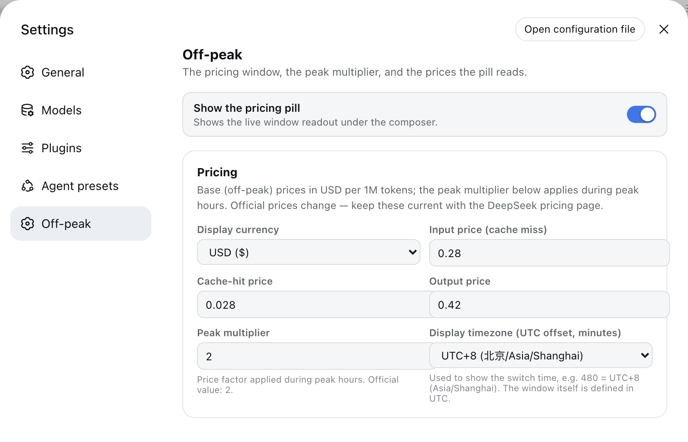

# dsh-offpeak

English | [中文](README.zh.md)

[](https://github.com/AlexShang1992/dsh-offpeak/actions/workflows/ci.yml)
[](https://github.com/AlexShang1992/dsh-offpeak/releases)
[](LICENSE)
[](package.json)

DeepSeek prices API usage in two daily windows defined in UTC. This plugin puts that fact where you can see it: one status pill under the composer of the DeepSeek Harness Web GUI, showing the current window, the price multiplier, and the countdown to the next switch — with the effective prices and the switch time on hover.

That is the whole plugin. It registers no tools and no commands, contributes nothing to any model request, stores no files, and makes no network calls.

| Peak window (×2) | Off-peak window (×1) |
| --- | --- |
| <picture><source media="(prefers-color-scheme: dark)" srcset="docs/screenshots/en/pill-peak-dark.png"></picture> | <picture><source media="(prefers-color-scheme: dark)" srcset="docs/screenshots/en/pill-offpeak-dark.png"></picture> |

## Pricing windows

| Window | UTC hours | Price |
| --- | --- | --- |
| Peak | 08:30 – 16:30 | `peakMultiplier` × base (official value **2**) |
| Off-peak | 16:30 – 08:30 | base |

The boundaries are DeepSeek's published windows and are fixed in `src/pricing.ts`; the multiplier, the three base prices, the display currency, and the display timezone are settings. `windowKindAt` places a boundary instant in the window that begins there: 08:30:00.000 UTC is peak, 16:30:00.000 UTC is off-peak.

The prices are **the ones you type in**, multiplied by the multiplier. The plugin reads no pricing page and no billing data, so an official price change is a change you have to make yourself.

## Installation

Requires a [DeepSeek Harness](https://github.com/deepseek-ai/deepseek-harness) Web profile on Node.js ≥ 22.19.

```sh
dsh plugin --profile web add https://github.com/AlexShang1992/dsh-offpeak/releases/latest/download/dsh-offpeak.tgz
```

Every release carries that packed tarball; swap `latest` for a tag
(`.../download/v0.1.0/dsh-offpeak.tgz`) to pin one. The package is not on npm
yet.

Installing the `github:` reference directly does **not** work: the repository
ships no build output, so the package would have to build itself through its
`prepare` script, and pnpm 10 refuses to run a dependency's lifecycle scripts
unless the consuming project allowlists it. The tarball needs no build step.

Restart `dsh --profile web`. The pill appears under the composer inside a session; the pricing form appears under **Settings → Off-peak**.

## What the pill shows

The bar itself carries the current window, the multiplier as `×N`, and the time to the next switch. Hovering (or focusing — it is keyboard reachable and announces itself through `role="status"`) opens the detail panel: the effective price of input, cache-hit, and output tokens per 1M in the current window, and the wall-clock time the next window starts, in your display timezone.

Everything there is derived in the browser from the settings below and the browser's own clock, through the same pure module the host validates — so the pill cannot drift from the settings it reads.

## Configuration

The `offpeak` settings namespace is registered with `applies: 'live'`: every field takes effect the moment you change it, with no restart.

<picture><source media="(prefers-color-scheme: dark)" srcset="docs/screenshots/en/settings-dark.png"></picture>

| Setting | Default | Meaning |
| --- | --- | --- |
| `enabled` | `true` | Show the pill |
| `currency` | `USD` | Display currency (`USD` or `CNY`, converted with `cnyPerUsd`) |
| `cnyPerUsd` | `7.1` | USD → CNY factor, used for display only |
| `inputPricePerM` | `0.28` | Base input (cache-miss) price, USD per 1M tokens |
| `cacheHitPricePerM` | `0.028` | Base cache-hit price, USD per 1M tokens |
| `outputPricePerM` | `0.42` | Base output price, USD per 1M tokens |
| `peakMultiplier` | `2` | Price factor during peak hours (1–100) |
| `displayUtcOffsetMinutes` | `480` | Offset used to display the switch time; the window itself is UTC |

The defaults follow DeepSeek's published prices at the time of writing. Keep them current.

## Composition

```yaml
- id: dsh-offpeak
  name: dsh-offpeak
```

`cordis.patch.yml` mounts that row after the Web app layer, so the profile's Loader resolves the package and the Web server serves the browser half from `/plugins/dsh-offpeak/client.js` — no second row is needed.

The host half injects `settings` and `typert`: it registers the settings namespace and mounts the `offpeak` Typert Remote service, whose entire surface is `getSettings` and `updateSettings`. The browser half injects `remote`, `slots`, `locale`, `sessions`, and `connection`, and contributes a `conversation.composer.dock` entry and a `settings.section` entry at order 40. Host and client share the zod codecs and invocation descriptors in `src/contract.ts`, so both calls are validated on the wire.

Settings persist through the harness's own settings provider under the `offpeak` namespace. The plugin writes no files of its own, and uninstalling it leaves nothing behind but that section.

## Model Experience

### What the model sees

Nothing. The plugin registers no tools, no commands, and no system-prompt section; it never calls `agent.steer()` and never appends to a session log. The pill is a browser-side rendering of settings the user typed, and the model has no way to observe that it exists.

### Token effect

Zero, in every request.

### KV Cache effect

None. The plugin contributes no request text, so it can neither extend nor invalidate a reusable prefix.

## Development

```sh
pnpm install          # also builds, through the prepare script
pnpm run check        # typecheck + test + lint + build, the CI gate
pnpm run test:watch
```

```
src/
  pricing.ts     pure window math and display helpers — host and browser
  contract.ts    wire contract: settings types, zod codecs, Typert invocations
  settings.ts    the `offpeak` settings namespace
  runtime.ts     OffpeakRuntime — the `offpeak` Typert Remote service
  index.ts       host plugin entry
  client/        browser half: status pill, settings section, en/zh dictionaries, styles
tests/           window boundaries, the Remote surface, stylesheet and locale contracts
```

Build output: `lib/index.js` (host ESM), `lib/client.js` (browser bundle), `lib/types/` (declarations).

Unit tests cannot see the seams that actually break — slot rendering, theme tokens, wire validation — so run the working copy in a real profile before trusting a change; [CONTRIBUTING.md](CONTRIBUTING.md) has the two commands. The screenshots in `docs/screenshots/` are captured from a running harness; see [docs/screenshots/README.md](docs/screenshots/README.md) before replacing them.

## Known Limitations and Deferred Work

- **The prices are yours, not DeepSeek's.** Nothing verifies them against the official pricing page or against what you were actually billed, so a stale table shows confidently wrong numbers.
- **The window boundaries are fixed in code.** Only the multiplier and the prices are configurable; a provider that moves its window needs a code change.
- **The pill counts down against the browser's clock.** A machine with a badly wrong clock shows a badly wrong window.
- **Web only.** The pill and the settings section are browser surfaces; a profile without the Web app loads the plugin and shows nothing.

## Security

Installing a plugin runs third-party code with your own permissions. This one writes no files, makes no network calls, and collects nothing; its only durable footprint is its own settings section. See [SECURITY.md](SECURITY.md).

## License

[MIT](LICENSE) © 2026 Alex Shang. Not affiliated with DeepSeek.
