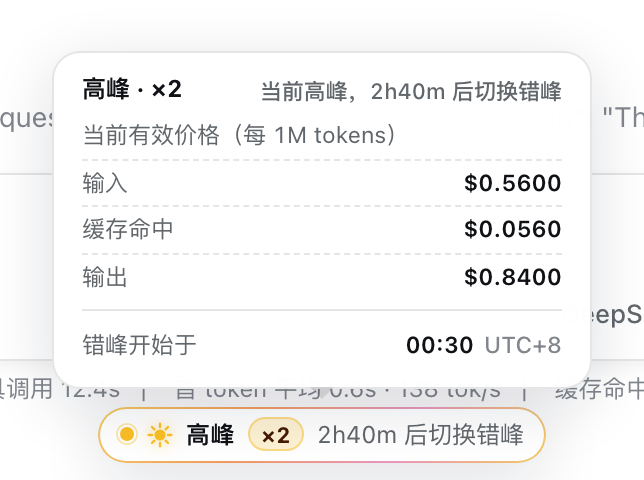
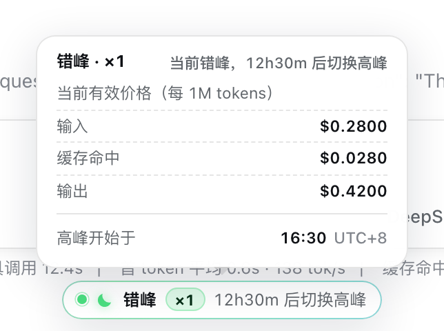
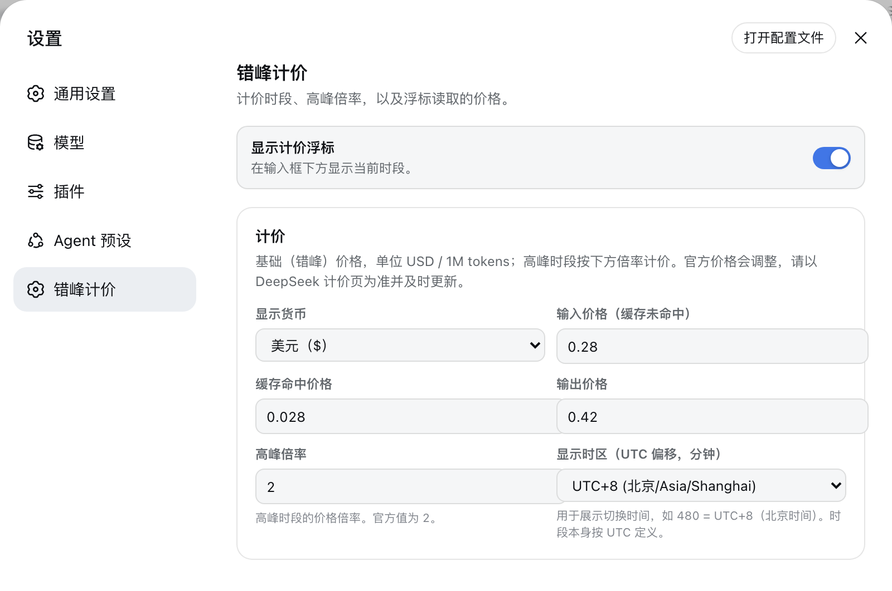

# dsh-offpeak

[English](README.md) | 中文

[](https://github.com/AlexShang1992/dsh-offpeak/actions/workflows/ci.yml)
[](https://github.com/AlexShang1992/dsh-offpeak/releases)
[](LICENSE)
[](package.json)

DeepSeek 按 UTC 定义的两个每日时段计价。本插件把这件事放到你看得见的地方：在 DeepSeek Harness Web GUI 的输入框下方显示一个状态浮标，给出当前时段、价格倍率与距下次切换的倒计时；鼠标悬停时展开当前有效价格和切换时间。

插件就这些。它不注册任何工具与命令，不向任何模型请求贡献内容，不写任何文件，也不发起任何网络请求。

| 高峰时段（×2） | 错峰时段（×1） |
| --- | --- |
| <picture><source media="(prefers-color-scheme: dark)" srcset="docs/screenshots/zh/pill-peak-dark.png"></picture> | <picture><source media="(prefers-color-scheme: dark)" srcset="docs/screenshots/zh/pill-offpeak-dark.png"></picture> |

## 计价时段

| 时段 | UTC 时间 | 价格 |
| --- | --- | --- |
| 高峰 | 08:30 – 16:30 | `peakMultiplier` × 基础价（官方值 **2**） |
| 错峰 | 16:30 – 08:30 | 基础价 |

时段边界取自 DeepSeek 公布的窗口，固定写在 `src/pricing.ts` 中；倍率、三档基础价、显示货币和显示时区都是设置项。`windowKindAt` 将边界时刻归入从该时刻开始的那个时段：08:30:00.000 UTC 属于高峰，16:30:00.000 UTC 属于错峰。

浮标显示的价格是**你自己填的价格**乘以倍率。插件不读取计价页，也不读取账单，因此官方调价后需要你自己更新。

## 安装

需要 Node.js ≥ 22.19 上的 [DeepSeek Harness](https://github.com/deepseek-ai/deepseek-harness) Web profile。

```sh
dsh plugin --profile web add https://github.com/AlexShang1992/dsh-offpeak/releases/latest/download/dsh-offpeak.tgz
```

每个 release 都会带上这个打包好的 tarball；把 `latest` 换成 tag
（`.../download/v0.1.0/dsh-offpeak.tgz`）即可钉住某个版本。本包尚未发布到 npm。

直接安装 `github:` 引用**不可行**：仓库不提交构建产物，包需要靠自己的 `prepare`
脚本构建，而 pnpm 10 默认拒绝执行依赖的生命周期脚本，除非使用方显式放行。
tarball 则不需要任何构建步骤。

重启 `dsh --profile web`。进入会话后浮标出现在输入框下方，计价表单出现在 **设置 → 错峰计价**。

## 浮标显示什么

横条本身显示当前时段、以 `×N` 表示的倍率，以及距下次切换的时间。悬停（或聚焦——它可由键盘访问，并通过 `role="status"` 播报）会展开详情面板：当前时段下输入、缓存命中、输出每 1M tokens 的有效价格，以及下一个时段开始的钟表时间（按你设置的显示时区）。

这些全部由浏览器根据下方设置和浏览器自身时钟推导得出，走的是 host 侧校验过的同一个纯模块——因此浮标不可能与它读取的设置脱节。

## 配置

`offpeak` 设置命名空间以 `applies: 'live'` 注册：每个字段改动即刻生效，无需重启。

<picture><source media="(prefers-color-scheme: dark)" srcset="docs/screenshots/zh/settings-dark.png"></picture>

| 设置项 | 默认值 | 含义 |
| --- | --- | --- |
| `enabled` | `true` | 是否显示浮标 |
| `currency` | `USD` | 显示货币（`USD` 或 `CNY`，按 `cnyPerUsd` 换算） |
| `cnyPerUsd` | `7.1` | 美元→人民币系数，仅用于展示 |
| `inputPricePerM` | `0.28` | 输入（缓存未命中）基础价，USD / 1M tokens |
| `cacheHitPricePerM` | `0.028` | 缓存命中基础价，USD / 1M tokens |
| `outputPricePerM` | `0.42` | 输出基础价，USD / 1M tokens |
| `peakMultiplier` | `2` | 高峰时段的价格倍率（1–100） |
| `displayUtcOffsetMinutes` | `480` | 展示切换时间所用的时区偏移；时段本身按 UTC 定义 |

默认值取自撰写时 DeepSeek 公布的价格，请及时更新。

## 组合方式

```yaml
- id: dsh-offpeak
  name: dsh-offpeak
```

`cordis.patch.yml` 会把这一行挂载在 Web app 层之后，于是 profile 的 Loader 能解析到该包，Web 服务端也会从 `/plugins/dsh-offpeak/client.js` 提供浏览器侧代码——不需要第二行配置。

Host 侧注入 `settings` 与 `typert`：注册设置命名空间，并挂载 `offpeak` Typert Remote 服务，其全部接口就是 `getSettings` 和 `updateSettings`。浏览器侧注入 `remote`、`slots`、`locale`、`sessions`、`connection`，并以 order 40 向 `conversation.composer.dock` 与 `settings.section` 各贡献一个条目。Host 与 client 共用 `src/contract.ts` 中的 zod 编解码器与 invocation 描述符，两个调用都在传输层被校验。

设置通过 harness 自身的 settings provider 以 `offpeak` 命名空间持久化。插件不写任何自己的文件，卸载后除了那一段设置外不留痕迹。

## 模型体验

### 模型所见内容

无。插件不注册工具、不注册命令、不贡献系统提示词段落，既不调用 `agent.steer()`，也不向会话日志追加任何内容。浮标只是浏览器对用户所填设置的一次渲染，模型无从得知它存在。

### Token 影响

每次请求都是零。

### KV Cache 影响

无。插件不贡献任何请求文本，因此既不会延长也不会失效任何可复用前缀。

## 开发

```sh
pnpm install          # 通过 prepare 脚本顺带完成构建
pnpm run check        # typecheck + test + lint + build，与 CI 等价
pnpm run test:watch
```

```
src/
  pricing.ts     纯时段计算与展示助手——host 与浏览器共用
  contract.ts    传输契约：设置类型、zod 编解码器、Typert invocation
  settings.ts    `offpeak` 设置命名空间
  runtime.ts     OffpeakRuntime——`offpeak` Typert Remote 服务
  index.ts       host 插件入口
  client/        浏览器侧：状态浮标、设置面板、中英词典、样式
tests/           时段边界、Remote 接口、样式表与词典契约
```

构建产物：`lib/index.js`（host ESM）、`lib/client.js`（浏览器 bundle）、`lib/types/`（类型声明）。

单元测试看不到真正容易坏的接缝——插槽渲染、主题 token、传输校验——所以改动后请先在真实 profile 里跑一遍再下结论，两条命令见 [CONTRIBUTING.md](CONTRIBUTING.md)。`docs/screenshots/` 中的截图取自真实运行的 harness，替换前请先阅读 [docs/screenshots/README.md](docs/screenshots/README.md)。

## 已知限制与后续工作

- **价格是你填的，不是 DeepSeek 给的。** 没有任何机制会拿它与官方计价页或你的实际账单核对，价格表过期时显示的就是自信而错误的数字。
- **时段边界固定在代码中。** 只有倍率与价格可配置；若服务商调整时段窗口，需要改代码。
- **倒计时依据浏览器时钟。** 机器时钟严重不准时，显示的时段也会严重不准。
- **仅限 Web。** 浮标与设置面板都是浏览器界面；没有 Web app 的 profile 会加载插件但什么也看不到。

## 安全

安装插件意味着以你自己的权限运行第三方代码。本插件不写文件、不发起网络请求、不收集任何数据，唯一的持久痕迹是它自己的设置段。详见 [SECURITY.md](SECURITY.md)。

## 许可

[MIT](LICENSE) © 2026 Alex Shang。与 DeepSeek 无隶属关系。
